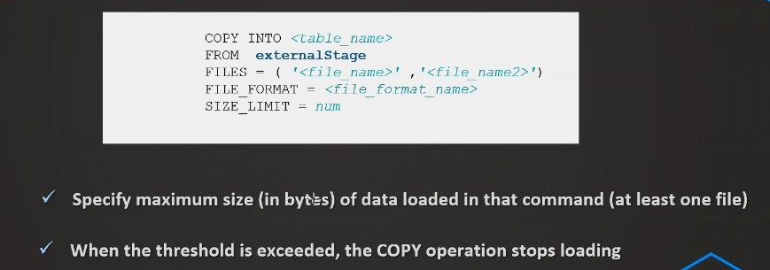
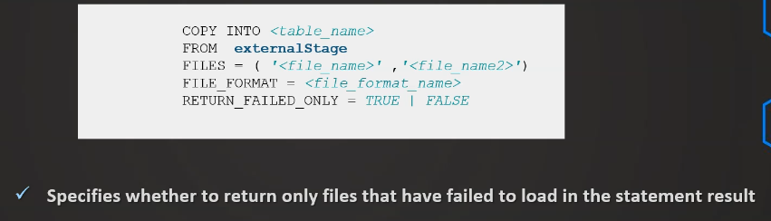
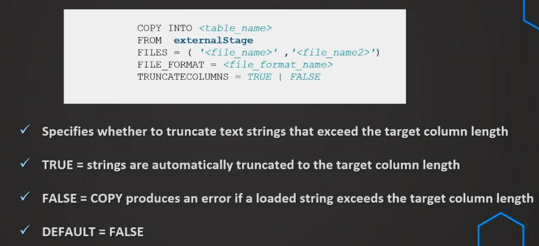

<h1>Section 5: Copy options</h1>
<h3>VALIDATION_MODE</h3>

```sql

---- VALIDATION_MODE ----
// Prepare database & table
CREATE OR REPLACE DATABASE COPY_DB;


CREATE OR REPLACE TABLE  COPY_DB.PUBLIC.ORDERS (
    ORDER_ID VARCHAR(30),
    AMOUNT VARCHAR(30),
    PROFIT INT,
    QUANTITY INT,
    CATEGORY VARCHAR(30),
    SUBCATEGORY VARCHAR(30));

// Prepare stage object
CREATE OR REPLACE STAGE COPY_DB.PUBLIC.aws_stage_copy
    url='s3://snowflakebucket-copyoption/size/';
  
LIST @COPY_DB.PUBLIC.aws_stage_copy;
  
    
 //Load data using copy command
COPY INTO COPY_DB.PUBLIC.ORDERS
    FROM @aws_stage_copy
    file_format= (type = csv field_delimiter=',' skip_header=1)
    pattern='.*Order.*'
    VALIDATION_MODE = RETURN_ERRORS;
    
    
COPY INTO COPY_DB.PUBLIC.ORDERS
    FROM @aws_stage_copy
    file_format= (type = csv field_delimiter=',' skip_header=1)
    pattern='.*Order.*'
   VALIDATION_MODE = RETURN_5_ROWS;
    
 ```
 
 <h3>Use files with errors</h3>
 
 ```sql
 
---- Use files with errors ----
CREATE OR REPLACE STAGE COPY_DB.PUBLIC.aws_stage_copy
    url='s3://snowflakebucket-copyoption/returnfailed/';

LIST @COPY_DB.PUBLIC.aws_stage_copy;    


COPY INTO COPY_DB.PUBLIC.ORDERS
    FROM @aws_stage_copy
    file_format= (type = csv field_delimiter=',' skip_header=1)
    pattern='.*Order.*'
    VALIDATION_MODE = RETURN_ERRORS;

USE DATABASE COPY_DB;

COPY INTO COPY_DB.PUBLIC.ORDERS
    FROM @aws_stage_copy
    file_format= (type = csv field_delimiter=',' skip_header=1)
    pattern='.*Order.*'
    VALIDATION_MODE = RETURN_1_rows;
    
```

<h3>Working with error results</h3>

```sql

-------------- Working with error results -----------

---- 1) Saving rejected files after VALIDATION_MODE ---- 

CREATE OR REPLACE TABLE  COPY_DB.PUBLIC.ORDERS (
    ORDER_ID VARCHAR(30),
    AMOUNT VARCHAR(30),
    PROFIT INT,
    QUANTITY INT,
    CATEGORY VARCHAR(30),
    SUBCATEGORY VARCHAR(30));


COPY INTO COPY_DB.PUBLIC.ORDERS
    FROM @aws_stage_copy
    file_format= (type = csv field_delimiter=',' skip_header=1)
    pattern='.*Order.*'
    VALIDATION_MODE = RETURN_ERRORS;


// Storing rejected /failed results in a table
CREATE OR REPLACE TABLE rejected AS 
select rejected_record from table(result_scan(last_query_id()));

INSERT INTO rejected
select rejected_record from table(result_scan(last_query_id()));

SELECT * FROM rejected;


COPY INTO COPY_DB.PUBLIC.ORDERS
    FROM @aws_stage_copy
    file_format= (type = csv field_delimiter=',' skip_header=1)
    pattern='.*Order.*'
    ON_ERROR=CONTINUE;
  
  
select * from table(validate(orders, job_id => '_last'));

```

<h3>Working with rejected records</h3>

```sql

SELECT REJECTED_RECORD FROM rejected;

CREATE OR REPLACE TABLE rejected_values as
SELECT 
SPLIT_PART(rejected_record,',',1) as ORDER_ID, 
SPLIT_PART(rejected_record,',',2) as AMOUNT, 
SPLIT_PART(rejected_record,',',3) as PROFIT, 
SPLIT_PART(rejected_record,',',4) as QUATNTITY, 
SPLIT_PART(rejected_record,',',5) as CATEGORY, 
SPLIT_PART(rejected_record,',',6) as SUBCATEGORY
FROM rejected;


SELECT * FROM rejected_values;

```

<h3>SIZE LIMIT</h3>



```sql 

// Prepare database & table
CREATE OR REPLACE DATABASE COPY_DB;

CREATE OR REPLACE TABLE  COPY_DB.PUBLIC.ORDERS (
    ORDER_ID VARCHAR(30),
    AMOUNT VARCHAR(30),
    PROFIT INT,
    QUANTITY INT,
    CATEGORY VARCHAR(30),
    SUBCATEGORY VARCHAR(30));
    
    
// Prepare stage object
CREATE OR REPLACE STAGE COPY_DB.PUBLIC.aws_stage_copy
    url='s3://snowflakebucket-copyoption/size/';
    
    
// List files in stage
LIST @aws_stage_copy;


//Load data using copy command
COPY INTO COPY_DB.PUBLIC.ORDERS
    FROM @aws_stage_copy
    file_format= (type = csv field_delimiter=',' skip_header=1)
    pattern='.*Order.*'
    SIZE_LIMIT=20000;
    
    
//Load data using copy command
// ATENCION! una vez q se cumple el limite de los 60000 rows no se cargan mas files
COPY INTO COPY_DB.PUBLIC.ORDERS
    FROM @aws_stage_copy
    file_format= (type = csv field_delimiter=',' skip_header=1)
    pattern='.*Order.*'
    SIZE_LIMIT=60000;

```

<h3>RETURN FAILED ONLY</h3>



```sql

CREATE OR REPLACE TABLE  COPY_DB.PUBLIC.ORDERS (
    ORDER_ID VARCHAR(30),
    AMOUNT VARCHAR(30),
    PROFIT INT,
    QUANTITY INT,
    CATEGORY VARCHAR(30),
    SUBCATEGORY VARCHAR(30));

// Prepare stage object
CREATE OR REPLACE STAGE COPY_DB.PUBLIC.aws_stage_copy
    url='s3://snowflakebucket-copyoption/returnfailed/';
  
LIST @COPY_DB.PUBLIC.aws_stage_copy;
  
USE DATABASE COPY_DB;

 //Load data using copy command
COPY INTO COPY_DB.PUBLIC.ORDERS
    FROM @aws_stage_copy
    file_format= (type = csv field_delimiter=',' skip_header=1)
    pattern='.*Order.*'
    RETURN_FAILED_ONLY = TRUE;
    
    
// para que la funcion anterior funcione tiene q ir acompaniado de la variable ON_ERROR= CONTINUE by Default = FALSE
// Esta funcion solo hace foco en aquellas files q contienen errores
COPY INTO COPY_DB.PUBLIC.ORDERS
    FROM @aws_stage_copy
    file_format= (type = csv field_delimiter=',' skip_header=1)
    pattern='.*Order.*'
    ON_ERROR =CONTINUE
    RETURN_FAILED_ONLY = TRUE;


// Default = FALSE

CREATE OR REPLACE TABLE  COPY_DB.PUBLIC.ORDERS (
    ORDER_ID VARCHAR(30),
    AMOUNT VARCHAR(30),
    PROFIT INT,
    QUANTITY INT,
    CATEGORY VARCHAR(30),
    SUBCATEGORY VARCHAR(30));


COPY INTO COPY_DB.PUBLIC.ORDERS
    FROM @aws_stage_copy
    file_format= (type = csv field_delimiter=',' skip_header=1)
    pattern='.*Order.*'
    ON_ERROR =CONTINUE;

```

<h3>Truncate Columns</h3>




```sql

---- TRUNCATECOLUMNS ----


CREATE OR REPLACE TABLE  COPY_DB.PUBLIC.ORDERS (
    ORDER_ID VARCHAR(30),
    AMOUNT VARCHAR(30),
    PROFIT INT,
    QUANTITY INT,
    CATEGORY VARCHAR(10),
    SUBCATEGORY VARCHAR(30));

// Prepare stage object
CREATE OR REPLACE STAGE COPY_DB.PUBLIC.aws_stage_copy
    url='s3://snowflakebucket-copyoption/size/';
  
LIST @COPY_DB.PUBLIC.aws_stage_copy;
  
    
 //Load data using copy command
COPY INTO COPY_DB.PUBLIC.ORDERS
    FROM @aws_stage_copy
    file_format= (type = csv field_delimiter=',' skip_header=1)
    pattern='.*Order.*';

// va a cortar lo q sobre luego de los 10 caracteres
COPY INTO COPY_DB.PUBLIC.ORDERS
    FROM @aws_stage_copy
    file_format= (type = csv field_delimiter=',' skip_header=1)
    pattern='.*Order.*'
    TRUNCATECOLUMNS = true;
    
    
SELECT * FROM ORDERS;


```
