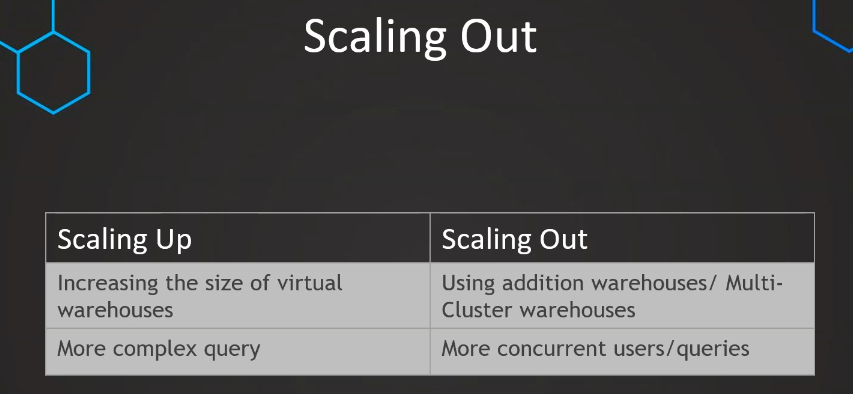

<h1>Section7: Performance Optimization</h1>

<h3>47. Implement dedicated virtual warehouse</h3>


```sql 

//  Create virtual warehouse for data scientist & DBA

// Data Scientists
CREATE WAREHOUSE DS_WH 
WITH WAREHOUSE_SIZE = 'SMALL'
WAREHOUSE_TYPE = 'STANDARD' 
AUTO_SUSPEND = 300 
AUTO_RESUME = TRUE 
MIN_CLUSTER_COUNT = 1 
MAX_CLUSTER_COUNT = 1 
SCALING_POLICY = 'STANDARD';

// DBA
CREATE WAREHOUSE DBA_WH 
WITH WAREHOUSE_SIZE = 'XSMALL'
WAREHOUSE_TYPE = 'STANDARD' 
AUTO_SUSPEND = 300 
AUTO_RESUME = TRUE 
MIN_CLUSTER_COUNT = 1 
MAX_CLUSTER_COUNT = 1 
SCALING_POLICY = 'STANDARD';


// Create role for Data Scientists & DBAs

CREATE ROLE DATA_SCIENTIST;
GRANT USAGE ON WAREHOUSE DS_WH TO ROLE DATA_SCIENTIST;

CREATE ROLE DBA;
GRANT USAGE ON WAREHOUSE DBA_WH TO ROLE DBA;


// Setting up users with roles

// Data Scientists
CREATE USER DS1 PASSWORD = 'DS1' LOGIN_NAME = 'DS1' DEFAULT_ROLE='DATA_SCIENTIST' DEFAULT_WAREHOUSE = 'DS_WH'  MUST_CHANGE_PASSWORD = FALSE;
CREATE USER DS2 PASSWORD = 'DS2' LOGIN_NAME = 'DS2' DEFAULT_ROLE='DATA_SCIENTIST' DEFAULT_WAREHOUSE = 'DS_WH'  MUST_CHANGE_PASSWORD = FALSE;
CREATE USER DS3 PASSWORD = 'DS3' LOGIN_NAME = 'DS3' DEFAULT_ROLE='DATA_SCIENTIST' DEFAULT_WAREHOUSE = 'DS_WH'  MUST_CHANGE_PASSWORD = FALSE;

GRANT ROLE DATA_SCIENTIST TO USER DS1;
GRANT ROLE DATA_SCIENTIST TO USER DS2;
GRANT ROLE DATA_SCIENTIST TO USER DS3;

// DBAs
CREATE USER DBA1 PASSWORD = 'DBA1' LOGIN_NAME = 'DBA1' DEFAULT_ROLE='DBA' DEFAULT_WAREHOUSE = 'DBA_WH'  MUST_CHANGE_PASSWORD = FALSE;
CREATE USER DBA2 PASSWORD = 'DBA2' LOGIN_NAME = 'DBA2' DEFAULT_ROLE='DBA' DEFAULT_WAREHOUSE = 'DBA_WH'  MUST_CHANGE_PASSWORD = FALSE;

GRANT ROLE DBA TO USER DBA1;
GRANT ROLE DBA TO USER DBA2;

// Drop objects again

DROP USER DBA1;
DROP USER DBA2;

DROP USER DS1;
DROP USER DS2;
DROP USER DS3;

DROP ROLE DATA_SCIENTIST;
DROP ROLE DBA;

DROP WAREHOUSE DS_WH;
DROP WAREHOUSE DBA_WH;


```

<h3>48. Scaling up</h3>


```sql 

ALTER WAREHOUSE COMPUTE_WH
SET WAREHOUSE_SIZE = 'SMALL'; 

```

** otra forma de hacerlo es desde la parte grafica... warehouses**


<h3>49. Scaling out</h3>



 

 

**se hace de forma grafica, tener en cuenta q debe ser mode standard**


```sql

SELECT * FROM SNOWFLAKE_SAMPLE_DATA.TPCDS_SF100TCL.WEB_SITE T1
CROSS JOIN SNOWFLAKE_SAMPLE_DATA.TPCDS_SF100TCL.WEB_SITE T2
CROSS JOIN SNOWFLAKE_SAMPLE_DATA.TPCDS_SF100TCL.WEB_SITE T3
CROSS JOIN (SELECT TOP 57 * FROM SNOWFLAKE_SAMPLE_DATA.TPCDS_SF100TCL.WEB_SITE)  T4

```
