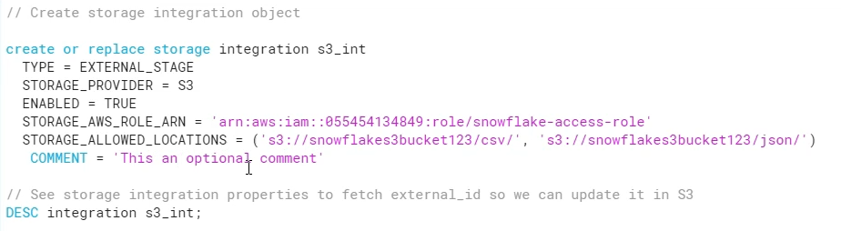

<h1>Section 8: Loading from AWS</h1>

```sql

// Create storage integration object

create or replace storage integration s3_int
  TYPE = EXTERNAL_STAGE
  STORAGE_PROVIDER = S3
  ENABLED = TRUE 
  STORAGE_AWS_ROLE_ARN = ''
  STORAGE_ALLOWED_LOCATIONS = ('s3://<your-bucket-name>/<your-path>/', 's3://<your-bucket-name>/<your-path>/')
   COMMENT = 'This an optional comment' 
   
   
// See storage integration properties to fetch external_id so we can update it in S3
DESC integration s3_int;

```

 
